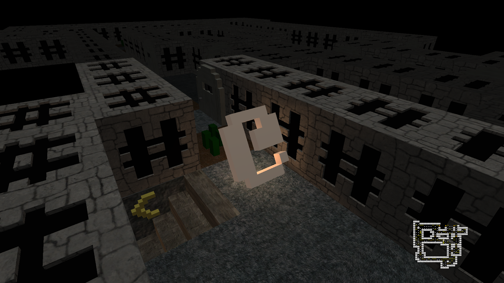
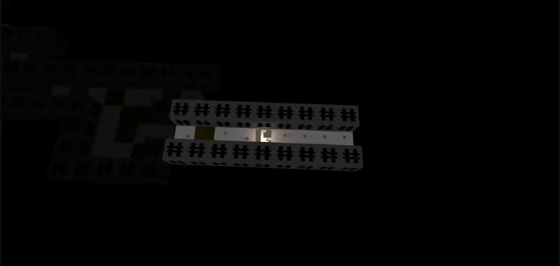

# Bringing Rogue to 3D

Uses the RogueSharp library (https://roguesharp.wordpress.com/), Stone and dirt textures from Skorpio at OpenGameArt.org (https://opengameart.org/content/3d-dungeon-tileset), Wood texture for door from West at OpenGameArt.org (https://opengameart.org/content/wall-grass-rock-stone-wood-and-dirt-480)

The game doesn't have any enemies currently, but has working player FOV, grass and door animations, and generates the map as player explores.

